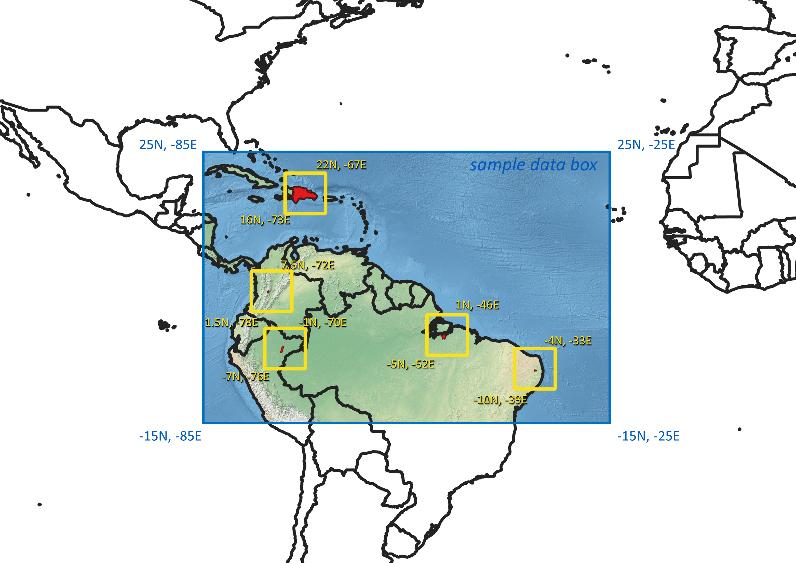

# Hotspots

## Location of the 5 hotspots of the [HARMONIZE project](https://www.harmonize-tools.org/)


## Suggested coordinate box for each of the hotspots to use when following the tutorial

```
# Dominican Republic
    lons.min <- -73    
    lons.max <- -67     
    lats.min <- 16   
    lats.max <- 22   
# Cajamarca (Colombia)
    lons.min <- -78    
    lons.max <- -72  
    lats.min <- 1.5   
    lats.max <- 7.5   
# Iquitos (Peru)
    lons.min <- -76    
    lons.max <- -70     
    lats.min <- -7   
    lats.max <- -1   
# Cametá (Brazil)
    lons.min <- -52    
    lons.max <- -46     
    lats.min <- -5   
    lats.max <- 1   
# Campina Grande (Brazil)
    lons.min <- -39    
    lons.max <- -33     
    lats.min <- -10   
    lats.max <- -4   
```

The [sample_data](https://github.com/harmonize-tools/climate-downscaling/tree/main/sample_data) included in this repository corresponds to the blue box in the image below. Any coordinates inside the blue box can be selected to follow the tutorial with the sample data; any of the yellow boxes (exact coordinates in the code above) is a good choice in terms of selecting a big enough area to understand the downscaling procedure and yet small enough to run all the suggested steps in just a few minutes.


