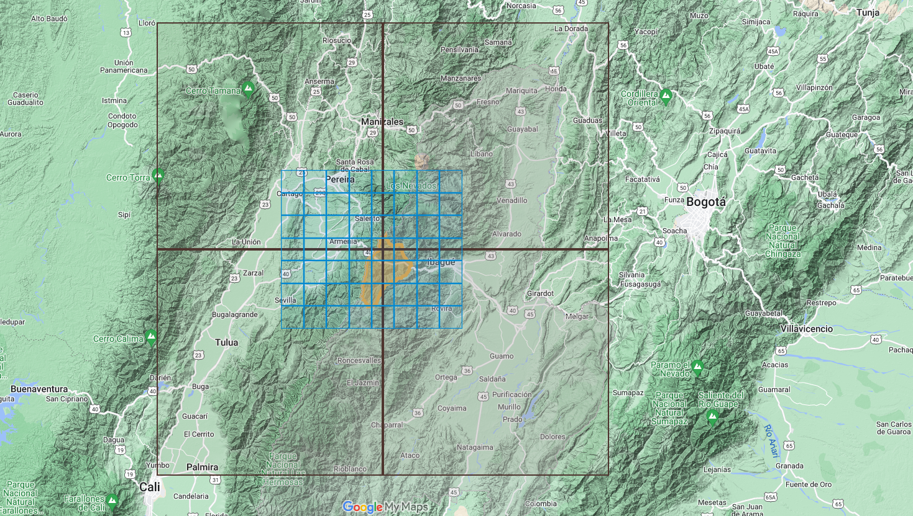
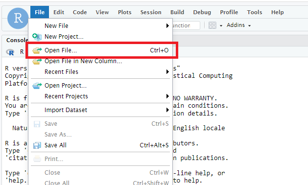
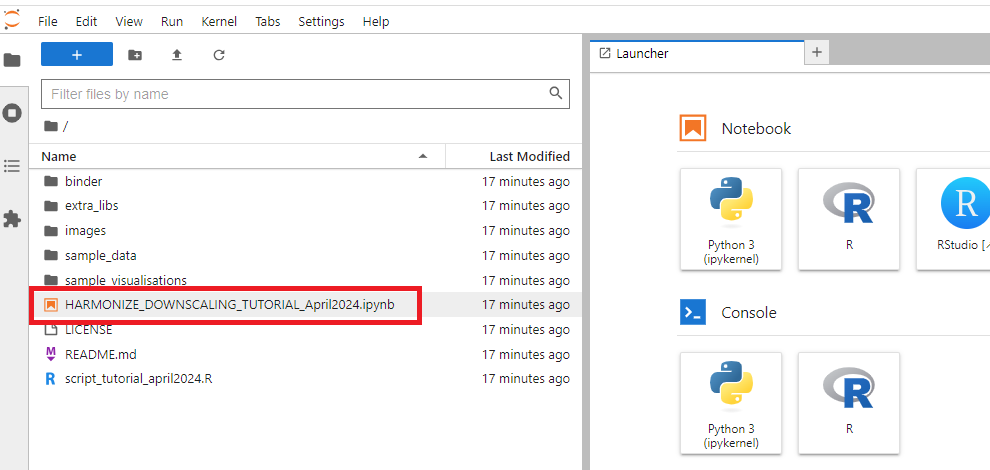
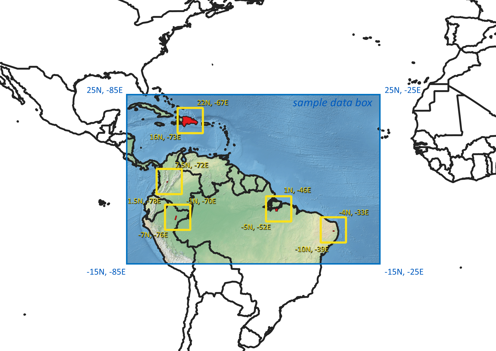
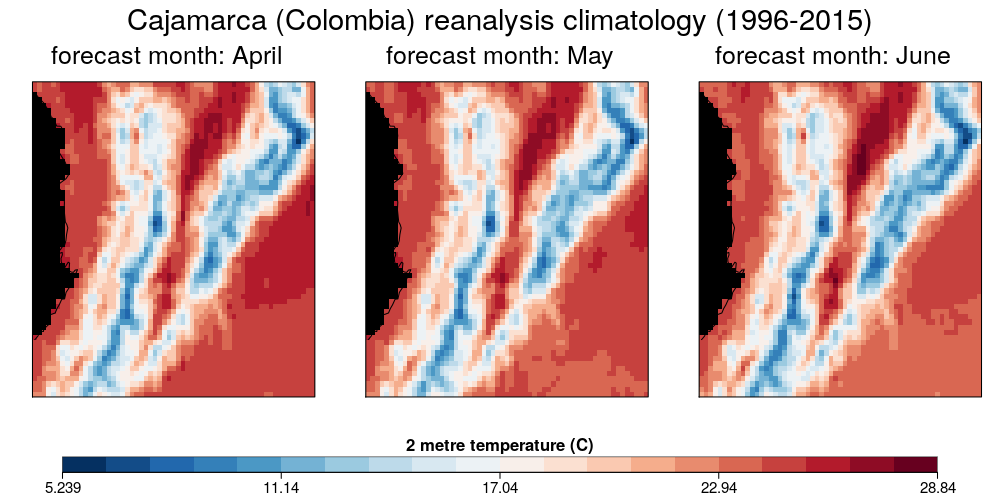
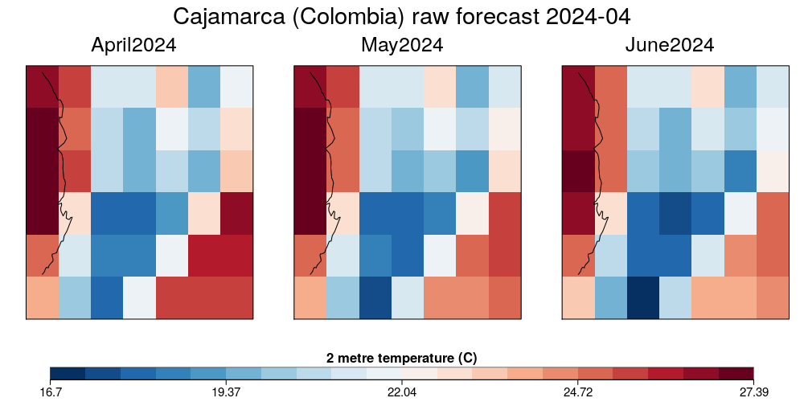
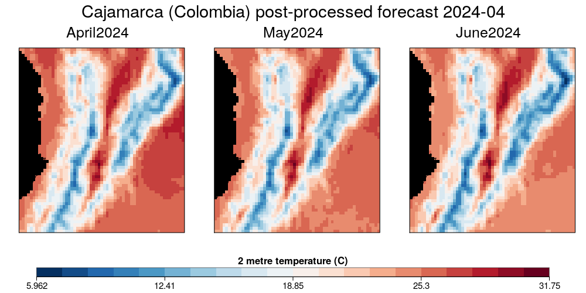
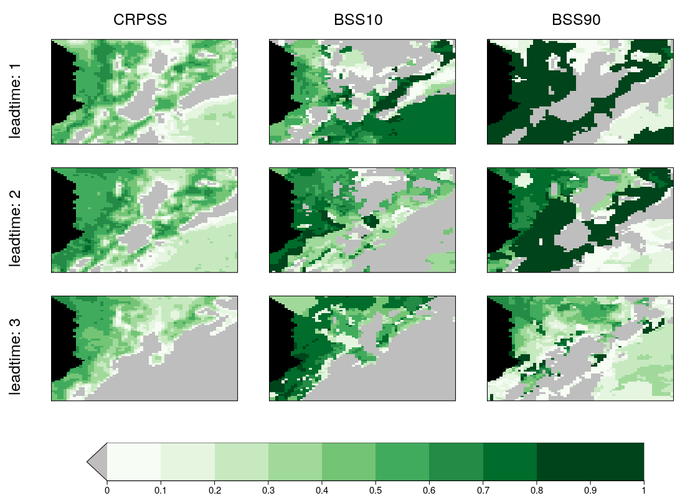

# Downscaling of Climate Data 

  

Tutorial to spatially downscale climate data in the hotspots of the [HARMONIZE project](https://www.harmonize-tools.org/)

# Context  [CSDownscale](https://earth.bsc.es/gitlab/es/csdownscale)
Downscaling allows for transferring climate information from coarse to fine grids. In this way, seasonal predictions, which are usually delivered in coarse grids, can be output refined to improve their value. It is worth noting that downscaling does not necessarily increase the overall skill (quality) of seasonal forecasts. Instead, it provides a more detailed spatial field of climate variables like temperature, precipitation or surface winds. A wide variety of downscaling methods do exist. Some statistical methods have been coded and included in the [CSDownscale](https://earth.bsc.es/gitlab/es/csdownscale) R package.



The spatial resolution of global seasonal forecasts (black squares in the image above) is usually much lower than the desired spatial resolution for regional applications (e.g. the municipality of Cajamarca in the deparment of Tolima (Colombia) represented in orange in the image). In this tutorial we will increase the spatial resolution of a ECMWF-system5.1 forecast (initial resolution of 1° x 1°) to the spatial resolution of ERA5-Land (0.1° x 0.1°) from a sample dataset openly available from the [Copernicus Climate Data Store](https://cds.climate.copernicus.eu/#!/home).

# Step 1: getting started on how to follow the tutorial
### Option 1 (cloud): 
Click the following icon to run the tutorial with binder: [](https://mybinder.org/v2/gh/harmonize-tools/climate-downscaling/HEAD) 
#### Option 1a:
* After the session starts the JupyterLab will open, click RStudio under Notebook to follow the tutorial in RStudio (see image below)
  
  

* Open **script_tutorial_april2024.R** by selecting the file from *FILE -> Open File...* and send the commands directly to the console with *CTRL+ENTER*
  
  

#### Option 2b:
* After the session starts the JupyterLab will open, double click on **HARMONIZE_DOWNSCALING_TUTORIAL_April2024.ipynb** on the left pannel (see image below) and follow the tutorial by directly modifying and executing the blocks of code.
  
  
  
### Option 2 (local): 
* Note that installation of CDO and the netcdf library configuration is requiered, check the instructions in [local_setup.md](https://github.com/harmonize-tools/climate-downscaling/blob/main/local_setup.md)
* Create a working directory and copy there at least the file [script_tutorial_april2024.R](https://github.com/harmonize-tools/climate-downscaling/blob/main/script_tutorial_april2024.R) file and the [sample_data](https://github.com/harmonize-tools/climate-downscaling/tree/main/sample_data) folder and its contents
* Open R or RStudio and set your working directory (```setwd()```) to the desired directory where you have saved the *sample_data*
* Load libraries and functions:
  ```
  if(!require('pacman')){install.packages('pacman')}
  pacman::p_load(ncdf4, startR, s2dv, CSTools, easyVerification, multiApply, ClimProjDiags, plyr, nnet, FNN, ecmwfr, devtools, lubridate)
  # source public code CSDownscale package (run either in Binder or Local):
  source("https://earth.bsc.es/gitlab/es/csdownscale/-/raw/master/R/Analogs.R")
  source("https://earth.bsc.es/gitlab/es/csdownscale/-/raw/master/R/Interpolation.R")
  source("https://earth.bsc.es/gitlab/es/csdownscale/-/raw/master/R/Intbc.R")
  source("https://earth.bsc.es/gitlab/es/csdownscale/-/raw/master/R/Intlr.R")
  source("https://earth.bsc.es/gitlab/es/csdownscale/-/raw/master/R/LogisticReg.R")
  source("https://earth.bsc.es/gitlab/es/csdownscale/-/raw/master/R/Utils.R")
  ```

* Open the file [**script_tutorial_april2024.R**](https://github.com/harmonize-tools/climate-downscaling/blob/main/script_tutorial_april2024.R) and follow the script from there

# Step 2: define parameters
Run the following lines of code to create the necessary parameters:

```
#climate variable (the same code is needed as variable name of the netcdf file and in the file name)
 var_name = 't2m' # 2m temperature
 
# reference period, forecast issue date and leadtimes
  reference_period <- c(1996:2015)
  forecast_issue_date <- '2024-04'
  leadtimes <- indices(1:3)

# configuration of sdate_hcst (array containing the initialisation dates of the reference period)
  sdate_hcst <- paste0(reference_period, substr(forecast_issue_date,6,7))

# configuration of sdate_fcst (array containing the initialisation dates of the forecast)
  sdate_fcst <- paste0(substr(forecast_issue_date,1,4), substr(forecast_issue_date,6,7))

# path where to find the sample data
  exp_path <- paste0('./sample_data/ecmwf51/$var$_$sdate$01.nc')  
  obs_path <- paste0('./sample_data/era5land/$var$_$date$.nc')
  obs_gridref <- paste0('./sample_data/era5land/', var_name, '_', reference_period[1], substr(forecast_issue_date,6,7), '.nc')  
```
                           
# Step 3: SELECTION of the region boundaries
The sample data is prepared for reginos inside lons (-85, -25) and lats (-15, 25).

## Location of the 5 hotspots of the [HARMONIZE project](https://www.harmonize-tools.org/)


## Suggested coordinate box for each of the hotspots to use when following the tutorial

```
# Dominican Republic
    region.name <- 'Dominican Republic'
    lons.min <- -73    
    lons.max <- -67     
    lats.min <- 16   
    lats.max <- 22   
# Cajamarca (Colombia)
    region.name <- 'Cajamarca (Colombia)'
    lons.min <- -78    
    lons.max <- -72  
    lats.min <- 1   
    lats.max <- 8   
# Iquitos (Peru)
    region.name <- 'Iquitos (Peru)'
    lons.min <- -76    
    lons.max <- -70     
    lats.min <- -7   
    lats.max <- -1   
# Cametá (Brazil)
    region.name <- 'Cametá (Brazil)'
    lons.min <- -52    
    lons.max <- -46     
    lats.min <- -5   
    lats.max <- 1   
# Campina Grande (Brazil)
    region.name <- 'Campina Grande (Brazil)'
    lons.min <- -39    
    lons.max <- -33     
    lats.min <- -10   
    lats.max <- -4   
```

The [sample_data](https://github.com/harmonize-tools/climate-downscaling/tree/main/sample_data) included in this repository corresponds to the blue box in the image below. Any coordinates inside the blue box can be selected to follow the tutorial with the sample data; any of the yellow boxes (exact coordinates in the code above) is a good choice in terms of selecting a big enough area to understand the downscaling procedure and yet small enough to run all the suggested steps in just a few minutes.



Run the following lines of code after modifying them if you want to select a different region:

```
  region.name <- 'Cajamarca (Colombia)'
  lons.min <- -78    
  lons.max <- -72  
  lats.min <- 1.5   
  lats.max <- 7.5  
```
  
# Step 4: Load data into the session
## Load and prepare hindcast data (seasonal prediction in the reference period)
```
  hcst <- startR::Start(
          dat = exp_path,
          var = var_name,
          sdate = sdate_hcst,
          ensemble = 'all',
          time = leadtimes,
          latitude = values(list(lats.min, lats.max)),
          latitude_reorder = Sort(decreasing = T),
          longitude = values(list(lons.min, lons.max)),
          longitude_reorder = CircularSort(-180,180),
          synonims = list(latitude = c('lat', 'latitude'),
                          longitude = c('lon', 'longitude'),
                          ensemble=c('member','ensemble','number')),
          return_vars = list(latitude = 'dat',
                              longitude = 'dat',
                              time = 'sdate'),
          retrieve = TRUE)

  # transform the units (from Kelvin to Celsius)
  if (attr(hcst, "Variables")$common[[2]]$units == 'K'){
      hcst <- hcst - 273.15
      attr(hcst, "Variables")$common[[2]]$units <- 'C'
  }
  # extract dates and coordinates
  dates_hcst <- attr(hcst, 'Variables')$common$time
  lats_hcst <- attr(hcst, "Variables")$dat1$latitude
  lons_hcst <- attr(hcst, "Variables")$dat1$longitude
```

## Load and prepare reanalysis data to be used as reference
```
  # Here, the dates of the previously loaded hindcast will be used
  # to retrieve the reanalysis. They will be the same as the hindcast times.
  dates_file <- format(dates_hcst, '%Y%m') # Giving dates format
  dim(dates_file) <- c(sdate = length(sdate_hcst), time = length(leadtimes)) # Specifying the dimensions 
  
  obs <- Start(# load observational (reanalysis) data
      dat = obs_path,
      var = var_name,
      date = dates_file,
      latitude = values(list(lats.min,lats.max)),
      latitude_reorder = Sort(decreasing = T),
      longitude = values(list(lons.min, lons.max)),
      longitude_reorder = CircularSort(-180,180),
      synonims = list(longitude = c('lon', 'longitude'),
                      latitude = c('lat', 'latitude')),
      split_multiselected_dims = TRUE,
      return_vars = list(time = 'date',
                          latitude = 'dat',
                          longitude = 'dat'),
      retrieve = TRUE)

  # transform the units (from Kelvin to Celsius)
  if (attr(obs, "Variables")$common[[2]]$units == 'K'){
      obs <- obs - 273.15
      attr(obs, "Variables")$common[[2]]$units <- 'C'
  }
  # extract dates and coordinates
  dates_obs <- attr(obs, 'Variables')$common$time
  lats_obs <- attr(obs, "Variables")$dat1$latitude
  lons_obs <- attr(obs, "Variables")$dat1$longitude 
```

## Load the forecast (a seasonal prediction into the future)
```
  fcst <- startR::Start(
      dat = exp_path,
      var = var_name,
      sdate = sdate_fcst,
      ensemble = 'all',
      time = leadtimes,
      latitude = values(list(lats.min, lats.max)),
      latitude_reorder = Sort(decreasing = T),
      longitude = values(list(lons.min, lons.max)),
      longitude_reorder = CircularSort(-180,180),
      synonims = list(latitude = c('lat', 'latitude'),
                      longitude = c('lon', 'longitude'),
                      ensemble=c('member','ensemble','number')),
      return_vars = list(latitude = 'dat',
                          longitude = 'dat',
                          time = 'sdate'),
      retrieve = TRUE)

  # transform the units (from Kelvin to Celsius)
  if (attr(fcst, "Variables")$common[[2]]$units == 'K'){
      fcst <- fcst - 273.15
      attr(fcst, "Variables")$common[[2]]$units <- 'C'
  }
  # extract dates and coordinates
  dates_fcst <- attr(fcst, 'Variables')$common$time
  lats_fcst <- attr(fcst, "Variables")$dat1$latitude
  lons_fcst <- attr(fcst, "Variables")$dat1$longitude 
```

## Calculate ensemble mean, climatologies, anomalies and seasonal averages for visualisations
```  
  hcst.ensemble_mean <- MeanDims(hcst, dim = 'ensemble', na.rm = TRUE)
  fcst.ensemble_mean <- MeanDims(fcst, dim = 'ensemble', na.rm = TRUE)

  hcst.clim <- MeanDims(hcst.ensemble_mean, dim = 'sdate', na.rm = TRUE)
  obs.clim <- MeanDims(obs, dim = 'sdate', na.rm = TRUE)

  hcst.anom <- Ano(data = hcst, clim = hcst.clim)
  fcst.anom <- Ano(data = fcst, clim = hcst.clim)
  obs.anom <- Ano(data = obs, clim = obs.clim)
  
  hcst.clim_season <- MeanDims(hcst.clim, dim = 'time', na.rm = TRUE)
  obs.clim_season <- MeanDims(obs.clim, dim = 'time', na.rm = TRUE)
  fcst.season_av <- MeanDims(fcst, dim = 'time', na.rm = TRUE)
```

# Step 5: Create some plots to visualise the loaded raw data
## Plot the climatology of the raw past predictions in comparison to the observations
```
 PlotLayout(fun = PlotEquiMap, 
             plot_dims = c('longitude', 'latitude'),
             var = ArrayToList(hcst.clim, 'time', names=''),
             lon = lons_hcst,
             lat = lats_hcst,
             filled.continents = FALSE,
             colNA = 'black',
             ncol = length(leadtimes),
             col_titles = paste0('forecast month: ', c(month(as.integer(substr(forecast_issue_date,6,7))+leadtimes-1, label = TRUE, abbr = FALSE))),
             nrow = 1,
             units = paste0(attr(hcst, "Variables")$common[[2]]$long_name, ' (', attr(hcst, "Variables")$common[[2]]$units, ')'),
             toptitle = paste0(region.name, ' hindcast climatology (', reference_period[1], '-',  reference_period[length(reference_period)], ')'),
             title_scale = 0.7,
             width = 10,
             height = 5,
             fileout = './plot1_hindcast_climatology.png'
 )
 PlotLayout(fun = PlotEquiMap, 
             plot_dims = c('longitude', 'latitude'),
             var = ArrayToList(obs.clim, 'time', names=''),
             lon = lons_obs,
             lat = lats_obs,
             filled.continents = FALSE,
             colNA = 'black',
             ncol = length(leadtimes),
             col_titles = paste0('forecast month: ', c(month(as.integer(substr(forecast_issue_date,6,7))+leadtimes-1, label = TRUE, abbr = FALSE))),
             nrow = 1,
             units = paste0(attr(obs, "Variables")$common[[2]]$long_name, ' (', attr(obs, "Variables")$common[[2]]$units, ')'),
             toptitle = paste0(region.name, ' reanalysis climatology (', reference_period[1], '-',  reference_period[length(reference_period)], ')'),
             title_scale = 0.7,
             width = 10,
             height = 5,
             fileout = './plot2_reanalysis_climatology.png'
  )
```




# Setp 6: SELECTION of the downscaling method
Several methods of downscaling are available from [CSDownscale](https://earth.bsc.es/gitlab/es/csdownscale). Select **1 of the 3** options of code blocks below and modify the indicated parameters to select the interpolation method and/or the bias adjustment or linear regression method.

## Option 1: interpolation
```
 # Interpolation : Included in Interpolation(). Regrid of a coarse-scale grid into a fine-scale grid, 
 #   or interpolate model data into a point location. Different interpolation methods, 
 #   based on different mathematical approaches, can be applied: conservative, nearest neighbour, bilinear or bicubic. 
 #   Does not rely on any data for training.
 
 # SELECTION: method_remap
 selection_method_remap <- 'con' # Accepted methods are "con", "bil", "bic", "nn", "con2", "dis"
 
 # perform dowsncaling with selected parameters
 downscaled_fcst <- Interpolation(exp = fcst, lats = lats_hcst, lons = lons_hcst,
                                 method_remap = selection_method_remap, 
                                 target_grid = obs_gridref, 
                                 lat_dim = "latitude", lon_dim = "longitude", region = NULL, 
                                 ncores = 7)
 
 # save metadata
 downscaled_fcst$metadata <- paste0('option 1 (interpolation) with method_remap ', selection_method_remap)
```

## Option 2: interpolation and bias adjustment
```
 # Interpolation plus bias adjustment : Included in Intbc(). interpolate model data into a fine-scale grid or point location. 
 #    Later, a bias adjustment of the interpolated values is performed. Bias adjustment techniques include simple bias correction, 
 #    calibration or quantile mapping.

 selection_int_method <- 'dis', # Accepted methods are "con", "bil", "bic", "nn", "con2", "dis"
 selection_bc_method <- 'evmos', # Accepted methods are 'bias', 'evmos','mse_min', 'crps_min', 'rpc-based' and 'quantile_mapping' (but last one only recommended for precipitation)
                                  
 # perform downscaling with selected parameters
 downscaled_fcst <- Intbc(exp = hcst, obs = obs, exp_cor = fcst, 
                                  exp_lats = lats_hcst, exp_lons = lons_hcst,
                                  obs_lats = lats_obs, obs_lons = lons_obs,            
                                  target_grid = obs_gridref,
                                  int_method = selection_int_method,
                                  bc_method = selection_bc_method,
                                  lat_dim = 'latitude', lon_dim = 'longitude', 
                                  member_dim = 'ensemble',
                                  sdate_dim = 'sdate', 
                                  ncores = 7)
 
 # save metadata
 downscaled_fcst$metadata <- paste0('option 2 (interpolation and bias correction) with int_method ', selection_int_method, ' and bc_method ', selection_bc_method)
```

## Option 3: interpolation and linear regression
```
 # Interpolation plus linear regression : Included in Intlr(..., method = 'basic'). Firstly, model data is interpolated into
 #   a fine-scale grid or point location. Later, a linear-regression with the interpolated values is fitted using
 #   high-res observations as predictands, and then applied with model data to correct the interpolated values.
 #   Stencil : Included in Intlr(..., method = '9nn'). A linear-regression with the nine nearest neighbours is fitted using 
 #   high-res observations as predictands. Instead of constructing a regression model using all the nine predictors, 
 #   principal component analysis is applied to the data of neighbouring grids to reduce the dimension of the predictors. 
 #   The linear regression model is then built using the principal components that explain 95% of the variance. 
 #   The '9nn' method does not require a pre-interpolation process.     

 selection_int_method <- 'con', # Accepted methods are "con", "bil", "bic", "nn", "con2".

 # perform downscaling with selected parameters:
 downscaled_fcst <- Intlr(exp = hcst, obs = obs, exp_cor = fcst, 
                                  exp_lats = lats_hcst, exp_lons = lons_hcst, 
                                  obs_lats = lats_obs, obs_lons = lons_obs, 
                                  int_method = selection_int_method,
                                  lr_method = 'basic', # Accepted methods are 'basic', 'large-scale' and '9nn'; recommended for the tutorial: 'basic' 
                                  predictors = NULL, # Only needed if the linear regression method is set to 'large-scale'.
                                  target_grid = obs_gridref, #'./sample_data/era5land/t2m_199604.nc',
                                  lat_dim = 'latitude', lon_dim = 'longitude', 
                                  member_dim = 'ensemble',
                                  sdate_dim = 'sdate', time_dim = 'time', 
                                  loocv = TRUE, ncores = 7)

 # save metadata
 downscaled_fcst$metadata <- paste0('option 3 (interpolation and linear regression) with int_method ', selection_int_method, ' and basic linear regression')
```

# Step 7: visualize raw forecast vs calibrated downscaled forecast
```
 # create new object with downscaled forecast data to overwrite the downscaled_field object later in the quality assessment step:
 downscaled_fcst <- downscaled_field$data
 # calculate ensemble mean for the visualisation:
 downscaled_fcst_ensemble_mean <- MeanDims(downscaled_fcst, dim = 'ensemble', na.rm = TRUE)
 raw_fcst_ensemble_mean <- MeanDims(fcst, dim = 'ensemble', na.rm = TRUE)

 # Plot raw forecast:
 PlotLayout(fun = PlotEquiMap, 
             plot_dims = c('longitude', 'latitude'),
             var = ArrayToList(raw_fcst_ensemble_mean, 'time', names=''),
             lon = lons_fcst,
             lat = lats_fcst,
             filled.continents = FALSE,
             colNA = 'black',
             ncol = length(leadtimes),
             col_titles = paste0(c(month(as.integer(substr(forecast_issue_date,6,7))+leadtimes-1, label = TRUE, abbr = FALSE)), substr(forecast_issue_date, 1, 4)),
             nrow = 1,
             units = paste0(attr(fcst, "Variables")$common[[2]]$long_name, ' (', attr(fcst, "Variables")$common[[2]]$units, ')'),
             toptitle = paste0(region.name, ' raw forecast ', forecast_issue_date),
             title_scale = 0.7,
             width = 10,
             height = 5,
             fileout = './plot3_forecast_raw.png'
  )
 PlotLayout(fun = PlotEquiMap,
            plot_dims = c('longitude', 'latitude'),
            var = ArrayToList(downscaled_fcst_ensemble_mean, 'time', names=''),
            lon = lons_obs, # because we have downscaled the forecast to the obs grid
            lat = lats_obs, # because we have downscaled the forecast to the obs grid
            filled.continents = FALSE,
            colNA = 'black',
            ncol = length(leadtimes),
            col_titles = paste0(c(month(as.integer(substr(forecast_issue_date,6,7))+leadtimes-1, label = TRUE, abbr = FALSE)), substr(forecast_issue_date, 1, 4)),
            nrow = 1,
            units = paste0(attr(fcst, "Variables")$common[[2]]$long_name, ' (', attr(fcst, "Variables")$common[[2]]$units, ')'),
            toptitle = paste0(region.name, ' post-processed forecast ', forecast_issue_date),
            title_scale = 0.7,
            width = 10,
            height = 5,
            fileout = './plot4_forecast_downscaled.png'
 )
```





# Step 8: Quality assessment
Run again the selected option for the downscaling of the forecast but this time to downscale the hindcast (and be able to assess the quality of the final product by comparing with past reference). Use the exact same option as before with the difference of selecting ```hcst``` instead of ```fcst``` and setting the parameter ```exp_cor = NULL```

## Option 1: interpolation
```
if (substr(downscaled_fcst$metadata, 8, 8) != 1){print('WARNING: this is NOT the method that was previously used to calibrate the forecast')
downscaled_field <- Interpolation(exp = hcst, lats = lats_hcst, lons = lons_hcst,
                                 method_remap = selection_method_remap, # Accepted methods are "con", "bil", "bic", "nn", "con2", "dis"
                                 target_grid = obs_gridref, 
                                 lat_dim = "latitude", lon_dim = "longitude", region = NULL, 
                                 ncores = 7)
downscaled_field$obs <- obs
```

## Option 2: interpolation and bias adjustment
```
 if (substr(downscaled_fcst$metadata, 8, 8) != 2){print('WARNING: this is NOT the method that was previously used to calibrate the forecast')
 downscaled_field <- Intbc(exp = hcst, obs = obs, exp_cor = NULL, 
                                 exp_lats = lats_hcst, exp_lons = lons_hcst,
                                 obs_lats = lats_obs, obs_lons = lons_obs,            
                                 target_grid = obs_gridref,
                                 int_method = selection_int_method, # Accepted methods are "con", "bil", "bic", "nn", "con2", "dis"
                                 bc_method = selection_bc_method, # Accepted methods are 'bias', 'evmos','mse_min', 'crps_min', 'rpc-based' and 'quantile_mapping' (but last one only recommended for precipitation)
                                 lat_dim = 'latitude', lon_dim = 'longitude', 
                                 member_dim = 'ensemble',
                                 sdate_dim = 'sdate', 
                                 ncores = 7)
```

## Option 3: interpolation and linear regression
```
 if (substr(downscaled_fcst$metadata, 8, 8) != 3){print('WARNING: this is NOT the method that was previouly used to calibrate the forecast')
 downscaled_field <- Intlr(exp = hcst, obs = obs, exp_cor = NULL, 
                                 exp_lats = lats_hcst, exp_lons = lons_hcst, 
                                 obs_lats = lats_obs, obs_lons = lons_obs, 
                                 int_method = selection_int_method, # Accepted methods are "con", "bil", "bic", "nn", "con2".
                                 lr_method = 'basic', # Accepted methods are 'basic', 'large-scale' and '9nn'; recommended for the tutorial: 'basic' 
                                 predictors = NULL, # Only needed if the linear regression method is set to 'large-scale'.
                                 target_grid = obs_gridref, #'./sample_data/era5land/t2m_199604.nc',
                                 lat_dim = 'latitude', lon_dim = 'longitude', 
                                 member_dim = 'ensemble',
                                 sdate_dim = 'sdate', time_dim = 'time', 
                                 loocv = TRUE, ncores = 7)
```

## Continue by calculating different metrics to assess the quality of the predictions

The CRPSS (Continuous Ranked Probability Skill Score) is typically used to evaluate the entire continuous probability distribution. It compares the probabilistic prediction against a reference prediction (climatological forecast). A positive CRPSS (up to 1) indicates that the prediction is better (in terms of predicting the whole distribution) than the reference hindcast, while a negative CRPSS indicates that the prediction is worse (in terms of predicting the whole distribution) than the reference hindcast.

The BSS10 and BSS90 (Brier Skill Score of the 10th and 90th percentile respectively) are used to evaluate the tails of the probability distribution (extremes). Positive values (up to 1) of BSS10 indicate that the seasonal prediction system is able to predict the abnormally low mean temperatures (or whichever is the variable), whereas positive values (up to 1) of BSS90 depicts skill in predicting abnormally high mean temperatures. As in the above skill score, the reference forecast used is the climatological forecast. The climatological forecast assigns, by definition, a probability of 0.1 to mean temperatures occurring below the 10th percentile of the climatological distribution, and the same probability for temperatures occurring above the 90th percentile of the same distribution.

```
 crpss <- veriApply('EnsCrpss', fcst = downscaled_field$data, obs = downscaled_field$obs,
                   tdim = which(names(dim(downscaled_field$data)) == 'sdate'), 
                   ensdim = which(names(dim(downscaled_field$data)) == 'ensemble'), na.rm = TRUE)[[1]]
 bss10 <- veriApply('EnsRpss', fcst = downscaled_field$data, obs = downscaled_field$obs,
                   prob = 1/10, tdim = which(names(dim(downscaled_field$data)) == 'sdate'), 
                   ensdim = which(names(dim(downscaled_field$data)) == 'ensemble'), na.rm = TRUE)[[1]] 
 bss90 <- veriApply('EnsRpss', fcst = downscaled_field$data, obs = downscaled_field$obs,
                   prob = 9/10, tdim = which(names(dim(downscaled_field$data)) == 'sdate'), 
                   ensdim = which(names(dim(downscaled_field$data)) == 'ensemble'), na.rm = TRUE)[[1]] 

 PlotLayout(fun = PlotEquiMap, 
    plot_dims = c('longitude', 'latitude'),
    var = append(append(ArrayToList(crpss, 'time', names=''), ArrayToList(bss10, 'time', names='')), ArrayToList(bss90, 'time', names='')),
    layout_by_rows = FALSE,
    colNA = 'black',
    brks = seq(0,1,0.1),
    col_inf = 'grey',
    cols = c('#f7fcf5', '#e5f5e0', '#c7e9c0', '#a1d99b', '#74c476', '#41ab5d', '#238b45', '#006d2c', '#00441b', '#00441b'),
    lon = lons_obs,
    lat = lats_obs,
    filled.continents = FALSE, 
    nrow = length(leadtimes),
    row_titles = paste0('leadtime: ', leadtimes),
    ncol = 3,
    col_titles = c('CRPSS', 'BSS10', 'BSS90'),
    fileout = './plot5_skill_assessment.png'
 )
```



# Your feedback
We would appreciate it if you would take a few minutes to fill this short [form](https://forms.gle/2pzn5eDfuCaY1TzU8) and sent us your feedback. Thanks!


