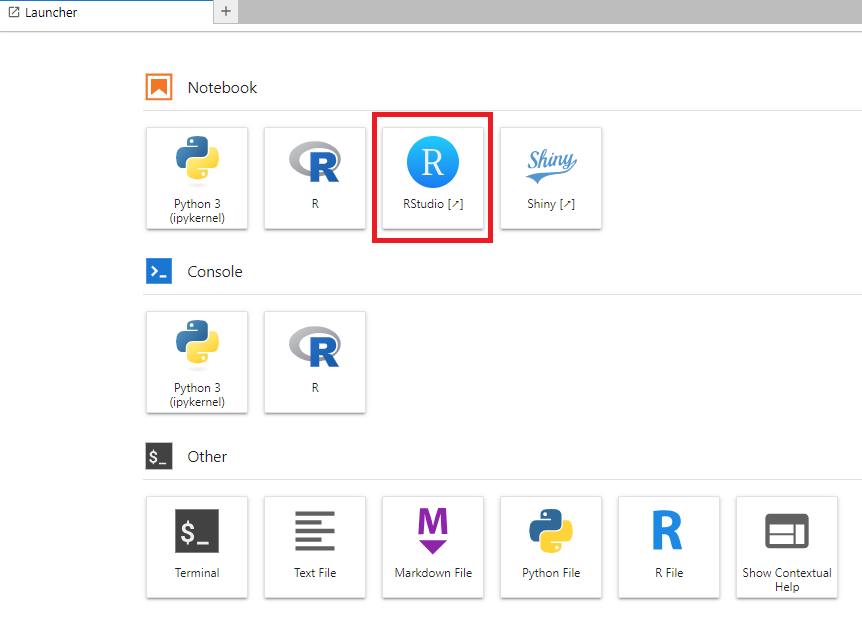
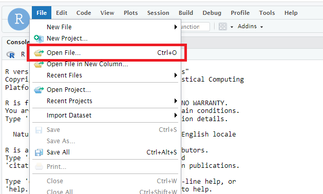
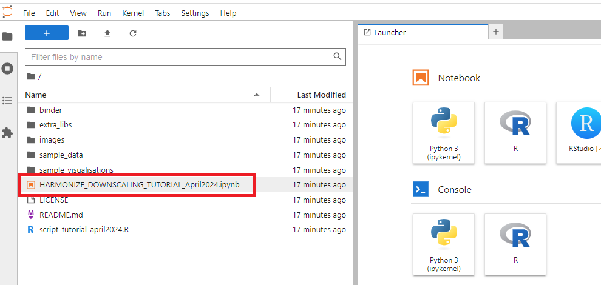

## Set up to follow the tutorial

### Option 1 (cloud): 
[](https://mybinder.org/v2/gh/harmonize-tools/climate-downscaling/HEAD) 
#### Option 1a:
* After the session starts the JupyterLab will open, click RStudio under Notebook to follow the tutorial in RStudio (see image below)
  

* Open **script_tutorial_april2024.R** by selecting the file from *FILE -> Open File...* and send the commands directly to the console with *CTRL+ENTER*
  

#### Option 2b:
* After the session starts the JupyterLab will open, double click on **HARMONIZE_DOWNSCALING_TUTORIAL_April2024.md** on the left pannel (see image below) and follow the tutorial by directly modifying and executing the blocks of code.
  
  
### Option 2 (local): 
* Note that installation of CDO and the netcdf library configuration is requiered
* Create a working directory and copy there at least the file [script_tutorial_april2024.R](https://github.com/harmonize-tools/climate-downscaling/blob/main/script_tutorial_april2024.R) file and the [sample_data](https://github.com/harmonize-tools/climate-downscaling/tree/main/sample_data) folder and its contents
* Open R or RStudio and set your working directory (```setwd()```) to the desired directory where you have saved the *sample_data*
* Load libraries and functions:
  ```
  if(!require('pacman')){install.packages('pacman')}
  pacman::p_load(ncdf4, startR, s2dv, CSTools, easyVerification, multiApply, ClimProjDiags, plyr, nnet, FNN, ecmwfr, devtools, lubridate)
  # source public code CSDownscale package (run either in Binder or Local):
  source("https://earth.bsc.es/gitlab/es/csdownscale/-/raw/master/R/Analogs.R")
  source("https://earth.bsc.es/gitlab/es/csdownscale/-/raw/master/R/Interpolation.R")
  source("https://earth.bsc.es/gitlab/es/csdownscale/-/raw/master/R/Intbc.R")
  source("https://earth.bsc.es/gitlab/es/csdownscale/-/raw/master/R/Intlr.R")
  source("https://earth.bsc.es/gitlab/es/csdownscale/-/raw/master/R/LogisticReg.R")
  source("https://earth.bsc.es/gitlab/es/csdownscale/-/raw/master/R/Utils.R")
  ```

* Open the file **script_tutorial_april2024.R** and follow the script from there
