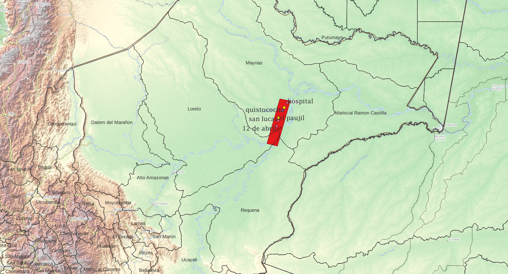

# Climate downscaling of seasonal forecasts to point locations (weather stations hotspot Iquitos)
Challenge: climate downscaling of seasonal forecasts to point locations (weather stations hotspot Iquitos)

